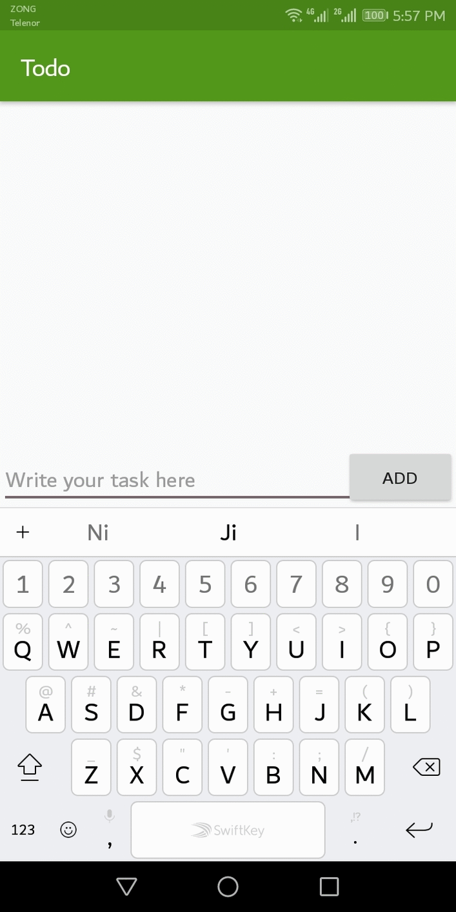

# Pre-work - *To do*

**To do** is an android app that allows building a todo list and basic todo items management functionality including adding new items, editing and deleting an existing item.

Submitted by: **Ghulam Qadir**

## User Stories

The following **required** functionality is completed:

* [x] User can **successfully add and remove items** from the todo list

The following **optional** features are implemented:

* [x] Add support for selecting the priority of each todo item (and display in listview item)

## Video Walkthrough 

### Version 1

Here's a walkthrough of implemented user tasks

## Notes

Describe any challenges encountered while building the app.

* Setting up ActiveAndroid took a while

## License

    Copyright [2018] [Jemi]

    Licensed under the Apache License, Version 2.0 (the "License");
    you may not use this file except in compliance with the License.
    You may obtain a copy of the License at

        http://www.apache.org/licenses/LICENSE-2.0

    Unless required by applicable law or agreed to in writing, software
    distributed under the License is distributed on an "AS IS" BASIS,
    WITHOUT WARRANTIES OR CONDITIONS OF ANY KIND, either express or implied.
    See the License for the specific language governing permissions and
    limitations under the License.
